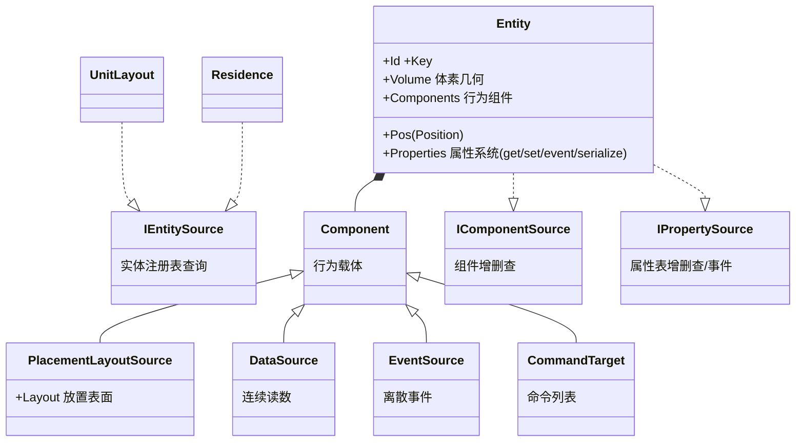
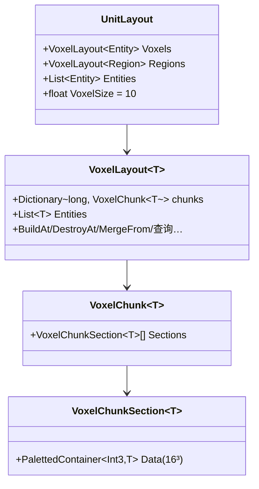
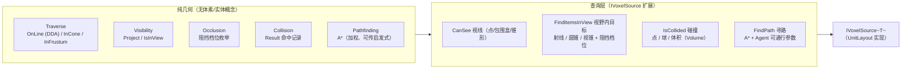
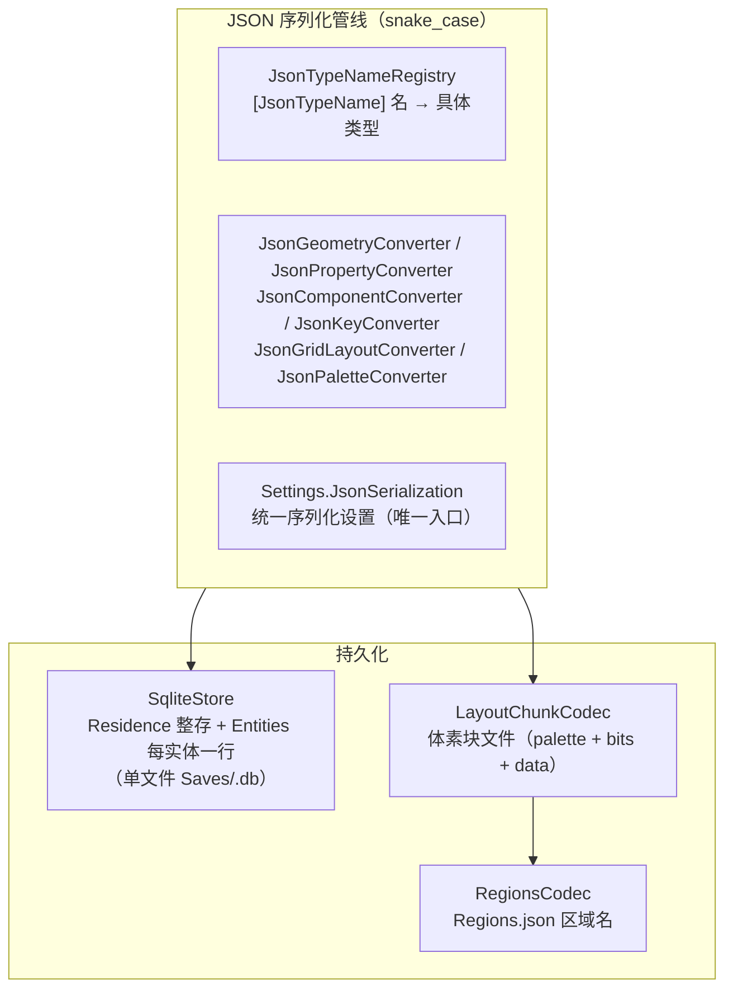

# Momoka.Home 架构设计

## 1. 总览

Momoka.Home 是家庭数字孪生模块：

| 子模块 | 职责 | 状态 |
|--------|------|------|
| **Models** | 实体、属性系统、空间数据结构（UnitLayout/VoxelLayout/GridLayout/ColumnLayout） | ✅ 核心完成 |
| **Algorithms** | 空间查询：视线 / 视野内目标 / 碰撞 / 寻路（Traverse/Visibility/Occlusion/Collision/Pathfinding） | ✅ 核心完成 |
| **Data** | JSON 序列化管线（JsonTypeNameRegistry + 转换器）与持久化（SqliteStore / LayoutChunkCodec / RegionsCodec） | ✅ 基础完成 |
| **Providers** | 设备执行层抽象（HA、GIIC） | 📋 待实现 |
| **Build** | 视频流 → 3D 重建 → 网格 | 📋 待实现 |
| **Security** | 危险操作风险评估与拦截 | 📋 待实现 |

---

## 2. 坐标系统（Primitives）

`Momoka.Home/Primitives/`，与 Models 平级，跨模块使用。

| 类型 | 精度 | 用途 |
|------|------|------|
| `Int2(X, Z)` | 整数，10cm 步长 | 2D 网格：墙体占位、区域包含、Graph2D 节点键 |
| `Int3(X, Y, Z)` | 整数，10cm 步长 | 3D 网格：分块容器索引、寻路节点 |
| `Float3(X, Y, Z)` | 连续浮点 | 连续位置、Shape 顶点、方向向量 |
| `Key(ns, path)` | — | 命名空间键：`momoka:door` |
| `Bound` | Float3 世界单位 | 轴对齐包围盒（Min/Max），网格边界与查询范围 |
| `Position` | 携带单位尺度 | 自描述坐标：`Pos` + `Scale`（cm 系数），`Absolute()` 恒返回真实 cm |

相互转换：`Int2 →(Y=0)→ Int3 →(Float)→ Float3`，`Float3 →(Round)→ Int3 →(Drop Y)→ Int2`；任意坐标经 `Position.Absolute()` 归一为世界 cm 后可与体素格互转（`GetAsRelative` / `GetAsAbsolute`）。

---

## 3. 属性系统（WPF DependencyObject 风格）

### 3.1 继承链



> 注：`Entity` 已非泛型化（`Entity<Int2>`/`Entity<Float3>` 删除），薄壳实体（`Wall`/`Door`/`Window`/`Appliance`/`Curtain`）与中间件（`Home`/`Level`/`Building`）已删除。所有物件扁平化为单一个 3D 实体，坐标 `Int3` 根绝对（经 `Position` 归一为 cm），`Volume` 描述体素几何。

### 3.2 Property 类型

`Property<T>` 基类 + `BooleanProperty` / `EnumProperty<T>` / `FloatProperty` / `IntProperty` / `StringProperty` / `LiteralProperty`。

### 3.3 Property API

`Name` / `Key` / `Description` / `ValueType` / `UnsetValue` / `Value`（每实例，typed `Value<T>`，未设 = `UnsetValue`）/ `IsReadOnly` / `ValidValues` / `IsValidType` / `IsValidValue` / `ToSchema()` / `Clone()`。

### 3.4 Entity 属性系统 API

`AddProperty` / `AddProperties` / `GetValue`/`SetValue`（Property 或 string 键）/ `ClearValue` / 索引器 / `event PropertyValueChanged` / `GetSchema()` / `ToDictionary()` / `Deserialize()`。

属性为**每实例对象**，值存放在 `Property.Value`；`CoerceValue` 已移除（无使用）。

### 3.5 序列化

中间格式 `Dictionary<string, object?>`，委托外部库（Newtonsoft.Json）。

---

## 4. 实体系统

### 4.1 行为组件与数据分离（接口驱动）

扁平化后 `Entity` 不再有空间子节点（空间层级——门挂墙、家具上台——规划为「墙体开口宿主 + 级联删除」，见 ROADMAP）。行为与数据经三个源接口统一暴露，实体只实现接口，操作全是扩展方法：

| 接口 | 职责 | 操作（扩展方法） |
|------|------|------|
| `IComponentSource` | 行为组件容器 | `AddComponent` / `RemoveComponent` / `GetComponent<T>` / `GetComponents<T>` / `TryGetComponent<T>` |
| `IPropertySource` | 每实例属性表 | `GetValue`/`SetValue`（名或键）/ `ClearValue` / `event PropertyValueChanged` / `IsImmutable()` 等 |
| `IEntitySource` | 实体注册表 | 按 Id / Key / 类型 / 包围盒 / 原点查询，`Traverse()` 遍历全部 |

- 行为脚本（`Component`）：数据源、命令接口平铺在实体上，不参与空间
- 空间查询能力（视线 / 碰撞 / 寻路）经 `IVoxelSource<T>`（`UnitLayout` 实现）对外暴露，见 §6

### 4.2 实体

实体类（`Momoka.Home.Entities`）：`Entity`（核心）+ `EntityTemplate` / `EntityTemplateFactory`（配置管线）。原薄壳（`Wall`/`Door`/`Window`/`Appliance`/`Curtain`）与中间件（`Home`/`Level`/`Building`）已删除——实体由配置模板（`EntityTemplate`）实例化，物件扁平放入 `UnitLayout`。

### 4.3 Volume/Shape 系统

`Volume` 抽象基类（3D 体素几何，实现 `IVoxelGeometry3D` + `IVoxelGeometry2D`）+ 异形族：`Box3D`/`Line3D`/`Curve3D`/`Polygon3D`/`Prism3D`/`Conic3D`/`Spherical3D`/`Extruded3D`/`Composite3D` + 2D 族 `Rect2D`/`Polygon2D`/`Circular2D`/`Composite2D`。全部以 `[JsonTypeName]` 注册进 `JsonTypeNameRegistry`（`Momoka.Home.Data.Json`），配置以 `"kind"` 判别、参数 snake_case 直绑。

---

## 5. 空间数据结构

### 5.1 UnitLayout — 完全 3D 多层空间根

`Momoka.Home/UnitLayout.cs`（已迁出 `Layouts/`，与 `Residence`/`UnitType` 同处根命名空间 `Momoka.Home`，`sealed`）。住宅的**单一扁平 3D 空间根**：地板/天花板/墙/家具全为 `Entity`（带 `Volume` 体素几何），坐标一律**根绝对**，无嵌套偏移链——放置与碰撞直接打在根空间。



`UnitLayout` 同时实现 `IEntitySource`（实体注册表）与 `IVoxelSource<Entity>`（空间查询源，见 §6）；`Voxels` 是底层纯格网，`Regions` 存区域标注（`Region`），`Entities` 是已放置实体列表。旧 `Floors`（户型图）与 `Surfaces` 放置面集合已退役——放置面由各实体 `PlacementLayoutSource` 组件按需暴露。

### 5.2 VoxelLayout — 区块式 3D 体素存储

Minecraft 式：XZ chunk 键**打包 long**（`(cx<<32)|cz`），每列是 `VoxelChunkSection`（16×16×16 paletted）沿高度轴的**可增长数组**；切片惰性创建，增高 = append 无需重算。约束 `T : Entity`，`VoxelLayout<Entity>` 即占用空间。API：`this[Int3]` / `BuildAt` / `DestroyAt` / `DestroyTarget` / `MergeFrom` / `RemoveFrom` / `HasEntity` / `IsEntityCollided` / `GetEntitiesInBound` / `GetEntitiesOfType` / `GetEntityAtPoint` / `GetEntityAtNearest` / `FindEntity` / `Rebuild`。

### 5.3 GridLayout — 2D 平面 + 放置面

`GridLayout<T>`：**连续数组**存储（Bound 定尺寸，无需分块）。放置语义：`Offset` / `Direction` / `AsAbsolute` / `AsRelative`（T 无关）+ `IsCollided` / `Fill`（`default(T)` 视为阻塞）。放置面 = `GridLayout<bool>`；材质分区由 `Subdivision<T>`（半边遍历）承担。原 `PlaneLayout` 已删除。

### 5.4 FloorPlanLayout — 墙图拓扑（已删除）

`FloorPlanLayout`（`Graph2D<Entity>`：隔断为边，`Subdivision` 半边遍历求房间面）已退役删除——3D `Region`（§5.6）直接由体素占用 + 放置面标注，不再需要户型图中间表示。

### 5.5 旧 Region — 已移除

旧 `Region` 类与 `Home`/`Level` 的 `Regions` 网格为死代码，已删除，由 §5.6 的 3D Region 取代。材质分区由 `Subdivision` 承担。

### 5.6 Region — 3D 空间标注（取代 FloorPlanLayout）

**本节已退役（2026-08-26）**：`ColumnLayout` 时代的 `Region.BuildLayout` 推导已删除——生产未接线、输出类型与 `LevelLayout.Regions`（`VoxelLayout<Region>`）不兼容。`Region` 现为纯数据值类型（Id / Bounds / Volume / Area / Name），RegionNames 按 id 持久化；自动推导需按 VoxelLayout 重写。原设计（供重写参考）：

`Region.BuildLayout(VoxelLayout, Agent?)` 一次构建 `ColumnLayout<Region>`。核心是通用引擎 `ColumnLayout<T>.Build<TA>(VoxelLayout<TA>, cells, Settings)`（`Layouts/`，纯数学）：

- **站立格 cells**：实体 `PlacementLayoutSource` 的 Up 面放置格 → 绝对体素坐标；仅带 `is_structural`（`BuiltinProperty.IS_STRUCTURAL`）实体的面为行走基底（地板/楼梯/庭院；桌顶、跑步机等排除）
- **span**：站立格向上延伸，止于下一站立格 / 占用格 / `Bound` 顶
- **连通**：邻列 span 间距 ≤ `Settings.MaxClimbHeight`（= `Agent.MaxClimbHeight`，人类 20cm）→ XZ 4-连通 flood-fill
- **阻隔即占用**：墙因占用格紧贴站立格自然断开；家具成“洞”（其格不入任何 Region，绕行仍连通）；行走基底由 `is_structural` + `Direction==Up` 双重条件决定
- **聚合**：每 Region 得 `Bounds` / `Volume`（cell³）/ `Area`（xz 足迹列数）；`ColumnLayout.Map` 把 label → Region
- **重算**：录入模型时手动 `UnitLayout.RebuildRegions(Agent?)` 一次；放置/拆除不自动重算；结构改动 → 全量重建
- 门/窗开口的 Portal（连通通道 + 开度）为气流模拟预留，暂未实现

---

## 6. 空间查询（Algorithms）

旧服务层（`PlacementService` / `RegionService` / `WallBuildingService` / `SelectionService`）与编辑器（`EditorCommand` / `CommandHistory`）已随扁平化重构删除——放置、碰撞、区域、撤销等具体编辑命令规划于 Phase 2 前重建（见 ROADMAP）。当前空间能力以**纯算法 + 源接口扩展**形式提供：



- **纯几何**：`Traverse`（Amanatides & Woo DDA 直线遍历 / 锥体 / 视锥包围盒扫描）、`Visibility`（点线分解 `Project`、圆柱视野 `IsInView`）、`Occlusion`（`None` / `OnlyImmutable` / `OnlyNonTransparent` / `Everything` 四档阻挡，null 空格不阻挡）、`Collision.Result<T>`（命中记录：实体 + 格 + 精确点）、`Pathfinding.AStar`（加权 A*，起点自带格尺度，可传启发式，0 启发式退化为 Dijkstra；失败由 `Result?` 的 null 表达，结果无 Reachable 标志）
- **查询层**：`VoxelSourceExtensions` 把几何接到体素网格上——视线（两点 / 包围盒最近点 / 锥形视野）、视野内目标（射线惰性 DDA 早停；圆锥 / 视锥按实体做严格射线遮挡判定 `IsOccluded(src, dest, occlusion, exclude)`，排除目标自身、None 短路）、碰撞（点 / 球 / `Volume` 体积，用于放置校验）、范围内实体（`GetItemsInBound`，占用格语义，经 `VoxelIterator` 扫列；与 `EntitySourceExtensions.GetEntitiesInBound(Bound)` 的锚点语义区分）、寻路（`FindPath`，XZ 4 连通 + 身高净高 + 支撑 + 爬升代价）
- 坐标约定：查询一律收世界 cm（`Position.Absolute()`），内部自动对齐 10cm 格；`Position` 自描述尺度贯穿全程

## 7. 数据与持久化（Data）



- **序列化**：`JsonTypeNameRegistry` 按族（2D / 3D）映射 `"kind"` → 具体类型，`Settings.JsonSerialization` 为唯一序列化入口（snake_case + 全部转换器）；`Palette` / `PalettedContainer` / `PackedBitStorage` 直接序列化为 `palette_json + bits + data` 载荷
- **Sqlite 存储（residence/entities）**：`SqliteStore`（linq2db + Microsoft.Data.Sqlite），`Residence` 整存 + `Entities` 每实体一行；体素层仍走 `LayoutChunkCodec` / `RegionsCodec` 文件层（Sqlite 体素层 `chunks` / `chunk_sections` 规划中）

---

## 8. 遗留代办 / 未来计划

### 8.0 空间与序列化收尾（当前）

| 项 | 说明 | 状态 |
|----|------|------|
| 3D Region 自动生成 | span flood-fill + 步高容差得房间/可行走区域（§5.6）；门开关（闭=阻塞/开=连通）Portal 与 wall-extension 后续 | ✅ 基础已实现 |
| 空间查询层 | `IVoxelSource<T>` + 扩展：视线 / 视野内目标（射线/圆锥/视锥）/ 碰撞 / 范围内实体 / 寻路（§6） | ✅ 已实现 |
| 放置 API | `UnitLayout.Add(entity[, position])` / `Remove(entity[, cascade])` / `Remove(Position)` / `Find(id|Position)`；删除 = 回落未放置池；`PlacementLayoutSource.Items` 表面宿主登记（级联回落 + 被依赖检查） | ✅ 已实现（`Add(Entity)` 自动寻位存根待实现） |
| 旧 Level/Building/Home 迁移 | 由 UnitLayout/Residence 取代；Floor/Ceiling 平面退役（地板/天花板改为 Entity 挂 PlacementLayoutSource） | ✅ 已迁移 |
| Residence 接线 | Home 重构为总容器（Name/Address + Layout=Residence），Residence 持 UnitLayout + UnitType | ✅ 已实现 |
| 实体模板替换薄壳 | Wall/Door/Window 由配置模板（EntityTemplate）替代；薄壳实体已删除 | ✅ 已完成 |
| Sqlite 存储（residence/entities） | `SqliteStore` 单文件存档；体素层仍走文件 codec（§7） | ✅ 已实现 |
| 物业/管理方引用层 | 统一管理多 Unit 的引用式封装（住户 Residence 默认全权，物业另层且不可见住户内容） | 📋 推迟 |
| Palette 策略减法 | 已删除 Int3ColumnSpanStrategy / Int3DenseStrategy / Int2DenseStrategy，保留 Int3ChunkStrategy / Int2ChunkStrategy | ✅ 已删除 |
| 门洞渲染 | 渲染属 Momoka.Ui（Home 不做渲染）；模型/材质由实体 Key 调取或 Property 表述；Home 只提供连通性（门开关 → 重算 Region） | 📋 待实现（Ui） |

### 8.1 其它（原待办）

| 项 | 说明 |
|----|------|
| Providers | `IDeviceProvider`、`ProviderRegistry`、HA 实现 |
| Build 管线 | 视频流 → 3D 重建 → 网格 |
| Security | Blackboard + 规则评估 |
| 墙壁开口联动 | 删除墙 → 级联删除门窗 |
| 设备配置 JSON | `/devices/` JSON 定义第三方设备，无需写代码 |
| DSL 安全规则 | 复杂约束的表达式解析 |
| 网格生成 | `Shape` / `Volume` 是 10cm 碰撞箱，Home 不保存模型 / 贴图；三角网格生成归 Momoka.Ui |

---

## 9. 目录总览

```
Momoka.Home/
├── Momoka.Home.csproj            # 依赖：Newtonsoft.Json / linq2db / Microsoft.Data.Sqlite
├── UnitLayout.cs / Residence.cs / Region.cs / Agent.cs / UnitType.cs / Settings.cs（根命名空间）
├── Primitives/
│   └── Int2.cs / Int3.cs / Float3.cs / Key.cs / Bound.cs / Position.cs
├── Properties/
│   ├── Property.cs + Boolean/Int/Float/String/Literal/Enum 子类
│   ├── IPropertySource.cs / PropertySourceExtensions.cs / PropertyValueChangedEventArgs.cs
├── Entities/
│   ├── Entity.cs（身份 + Pos + Volume + 属性 + 组件，非泛型）
│   ├── IEntitySource.cs / EntitySource.cs（实体注册表查询扩展）
│   └── EntityTemplate.cs / EntityTemplateFactory.cs（配置管线）
├── Components/
│   ├── Component.cs / IComponentSource.cs / ComponentSourceExtensions.cs
│   └── PlacementLayoutSource.cs / DataSource.cs / EventSource.cs / CommandTarget.cs
├── Geometry/
│   ├── Volume.cs / Shape.cs / IVoxelGeometry2D.cs / IVoxelGeometry3D.cs
│   ├── Box3D / Line3D / Curve3D / Polygon3D / Prism3D / Conic3D / Spherical3D /
│   │   Extruded3D / Composite3D（3D 族）
│   └── Rect2D / Polygon2D / Circular2D / Composite2D（2D 族）
├── Layouts/（纯运算 / 数学布局）
│   ├── VoxelLayout.cs（VoxelLayout/VoxelChunk/VoxelChunkSection）/ GridLayout.cs / ColumnLayout.cs
│   ├── Palette.cs / PackedBitStorage.cs / PalettedContainer.cs / PalettedContainerRO.cs
│   ├── Graph.cs（Graph/Graph2D/Graph3D）/ Subdivision.cs
│   └── VoxelSource.cs（IVoxelSource + 空间查询扩展）
├── Algorithms/（纯几何 / 纯算法）
│   └── Traverse.cs / Visibility.cs / Occlusion.cs / Collision.cs / Pathfinding.cs
├── Data/
│   ├── Json/（JsonTypeNameAttribute / JsonTypeNameRegistry）
│   │   └── Converters/（JsonTypeConverter / JsonGeometryConverter / JsonPropertyConverter /
│   │       JsonComponentConverter / JsonKeyConverter / JsonGridLayoutConverter / JsonPaletteConverter）
│   ├── Sqlite/（DbConnection / SqliteStore）
│   ├── LayoutChunkCodec.cs / RegionsCodec.cs（体素文件层）
├── Helpers/
│   └── ValueHelper.cs（floor 除法 / 取模）
```
