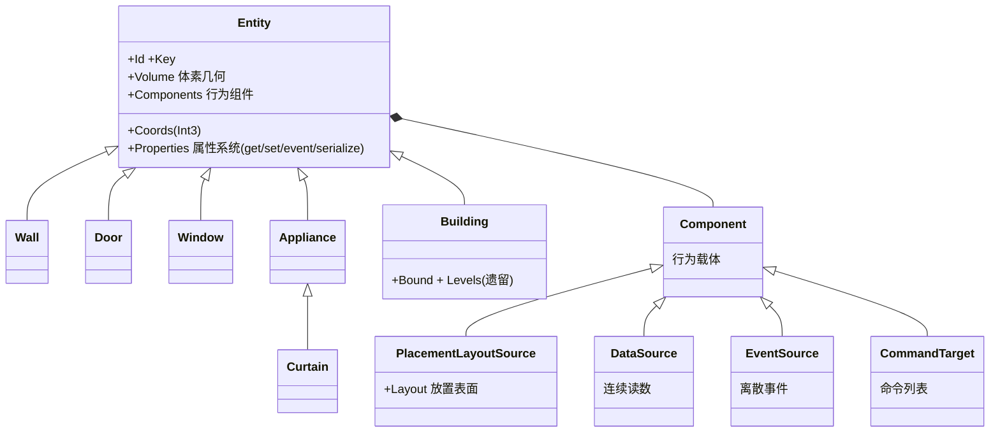
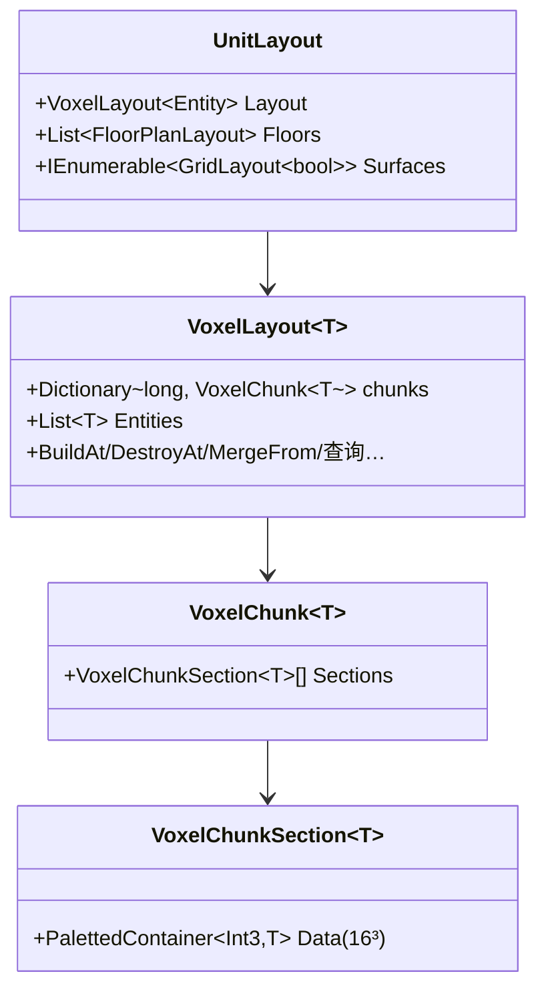
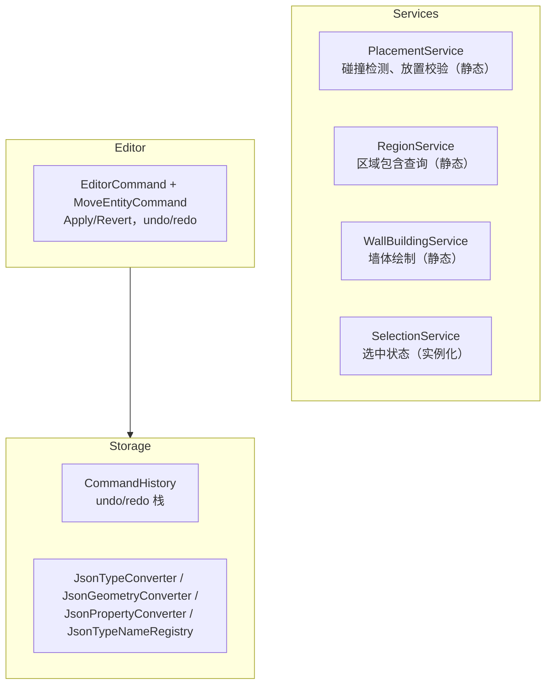
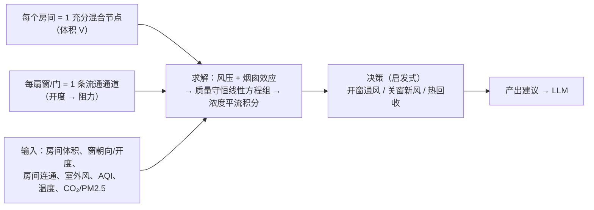

# Momoka.Home 架构设计

## 1. 总览

Momoka.Home 是家庭数字孪生模块：

| 子模块 | 职责 | 状态 |
|--------|------|------|
| **Models** | 实体、属性系统、空间数据结构（UnitLayout/VoxelLayout/GridLayout/FloorPlanLayout） | ✅ 核心完成 |
| **Services** | 放置/区域/墙体绘制等行为层 | ✅ 基础完成 |
| **Editor** | 编辑器命令（undo/redo） | ✅ 基础完成 |
| **Storage** | 存档、命令历史 | ✅ 基础完成 |
| **Providers** | 设备执行层抽象（HA、GIIC） | 📋 待实现 |
| **Build** | 视频流 → 3D 重建 → 网格 | 📋 待实现 |
| **Security** | 危险操作风险评估与拦截 | 📋 待实现 |

---

## 2. 坐标系统（Primitives）

`Momoka.Home/Primitives/`，与 Models 平级，跨模块使用。

| 类型 | 精度 | 用途 |
|------|------|------|
| `Int2(X, Z)` | 整数，10cm 步长 | 2D 网格：墙体占位、区域包含、BlockGraph 节点键 |
| `Int3(X, Y, Z)` | 整数，10cm 步长 | 3D 网格：分块容器索引 |
| `Float3(X, Y, Z)` | 连续浮点 | 移动实体位置、Shape 顶点 |
| `Key(ns, path)` | — | 命名空间键：`momoka:door` |

相互转换：`Int2 →(Y=0)→ Int3 →(隐式)→ Float3`，`Float3 →(Round)→ Int3 →(Drop Y)→ Int2`。

---

## 3. 属性系统（WPF DependencyObject 风格）

### 3.1 继承链



> 注：`Entity` 已非泛型化（`Entity<Int2>`/`Entity<Float3>` 删除）。所有物件扁平化为单一个 3D 实体，坐标 `Int3` 根绝对，`Volume` 描述体素几何。

### 3.2 Property 类型

`Property<T>` 基类 + `BooleanProperty` / `EnumProperty<T>` / `FloatProperty` / `IntProperty` / `StringProperty` / `LiteralProperty`。

### 3.3 Property API

`Name` / `Key` / `Description` / `ValueType` / `UnsetValue` / `Value`（每实例，typed `Value<T>`，未设 = `UnsetValue`）/ `IsReadOnly` / `ValidValues` / `IsValidType` / `IsValidValue` / `ToSchema()` / `Clone()`。

### 3.4 Entity 属性系统 API

`AddProperty` / `AddProperties` / `GetValue`/`SetValue`（Property 或 string 键）/ `ClearValue` / 索引器 / `event PropertyValueChanged` / `GetSchema()` / `ToDictionary()` / `Deserialize()`。

属性为**每实例对象**，值存放在 `Property.Value`；`CoerceValue` 已移除（无使用）。

### 3.5 序列化

中间格式 `Dictionary<string, object?>`，委托外部库（Newtonsoft.Json）。

---

## 4. 实体系统

### 4.1 Children 与 Components 分离（Unity 风格）

| | Children（空间层级） | Components（行为脚本） |
|---|---|---|
| 添加/移除 | `AddChild` / `RemoveChild` | `AddComponent` / `RemoveComponent` |
| 查询 | `GetChild<T>()` / `GetChild(Guid)` / `FindChild(Guid)` | `GetComponent<T>()` / `GetComponents<T>()` / `GetComponentInChildren<T>()` / `TryGetComponent` |
| 遍历 | `Traverse()`（空间树） | — |

- 空间层级：门挂在墙上、笔记本放在桌上——删除宿主级联删除子物件
- 行为脚本：数据源、命令接口平铺，不参与空间

### 4.2 实体

实体类（`Momoka.Home.Entities`）：`Entity`（核心）+ `EntityTemplate` / `EntityTemplateFactory`（配置管线）。原薄壳（`Wall`/`Door`/`Window`/`Appliance`/`Curtain`）与中间件（`Home`/`Level`/`Building`）已删除——实体由配置模板（`EntityTemplate`）实例化，物件扁平放入 `UnitLayout`。

### 4.3 Volume/Shape 系统

`Volume` 抽象基类（3D 体素几何，实现 `IVoxelGeometry3D` + `IVoxelGeometry2D`）+ 异形族：`Box3D`/`Line3D`/`Curve3D`/`Polygon3D`/`Prism3D`/`Conic3D`/`Spherical3D`/`Extruded3D`/`Composite3D` + 2D 族 `Rect2D`/`Polygon2D`/`Circular2D`/`Composite2D`。全部以 `[JsonTypeName]` 注册进 `JsonTypeNameRegistry`（`Momoka.Home.Storage`），配置以 `"kind"` 判别、参数 snake_case 直绑。

---

## 5. 空间数据结构

### 5.1 UnitLayout — 完全 3D 多层空间根

`Momoka.Home/UnitLayout.cs`（已迁出 `Layouts/`，与 `Residence`/`UnitType` 同处根命名空间 `Momoka.Home`，`sealed`）。住宅的**单一扁平 3D 空间根**：地板/天花板/墙/家具全为 `Entity`（带 `Volume` 体素几何），坐标一律**根绝对**，无嵌套偏移链——放置与碰撞直接打在根空间。



`Surfaces`：各实体 `PlacementLayoutSource` 的放置面（地板顶面、书架板等）。旧 `Floors`（户型图）已退役。

### 5.2 VoxelLayout — 区块式 3D 体素存储

Minecraft 式：XZ chunk 键**打包 long**（`(cx<<32)|cz`），每列是 `VoxelChunkSection`（16×16×16 paletted）沿高度轴的**可增长数组**；切片惰性创建，增高 = append 无需重算。约束 `T : Entity`，`VoxelLayout<Entity>` 即占用空间。API：`this[Int3]` / `BuildAt` / `DestroyAt` / `DestroyTarget` / `MergeFrom` / `RemoveFrom` / `HasEntity` / `IsEntityCollided` / `GetEntitiesInBound` / `GetEntitiesOfType` / `GetEntityAtPoint` / `GetEntityAtNearest` / `FindEntity` / `Rebuild`。

### 5.3 GridLayout — 2D 平面 + 放置面

`GridLayout<T>`：**连续数组**存储（Bound 定尺寸，无需分块）。放置语义：`Offset` / `Direction` / `AsAbsolute` / `AsRelative`（T 无关）+ `IsCollided` / `Fill`（`default(T)` 视为阻塞）。放置面 = `GridLayout<bool>`；材质分区由 `Subdivision<T>`（半边遍历）承担。原 `PlaneLayout` 已删除。

### 5.4 FloorPlanLayout — 墙图拓扑（已删除）

`FloorPlanLayout`（`Graph2D<Entity>`：隔断为边，`Subdivision` 半边遍历求房间面）已退役删除——3D `Region`（§5.6）直接由体素占用 + 放置面标注，不再需要户型图中间表示。

### 5.5 旧 Region — 已移除

旧 `Region` 类与 `Home`/`Level` 的 `Regions` 网格为死代码，已删除，由 §5.6 的 3D Region 取代。材质分区由 `Subdivision` 承担。

### 5.6 Region — 3D 空间标注（取代 FloorPlanLayout）

`Momoka.Home/Regions/Region.cs`：`Region.BuildLayout(VoxelLayout, Agent?)` 一次构建 `ColumnLayout<Region>`。核心是通用引擎 `ColumnLayout<T>.Build<TA>(VoxelLayout<TA>, cells, Settings)`（`Layouts/`，纯数学）：

- **站立格 cells**：实体 `PlacementLayoutSource` 的 Up 面放置格 → 绝对体素坐标；仅带 `is_structural`（`BuiltinProperty.IS_STRUCTURAL`）实体的面为行走基底（地板/楼梯/庭院；桌顶、跑步机等排除）
- **span**：站立格向上延伸，止于下一站立格 / 占用格 / `Bound` 顶
- **连通**：邻列 span 间距 ≤ `Settings.MaxClimbHeight`（= `Agent.MaxClimbHeight`，人类 20cm）→ XZ 4-连通 flood-fill
- **阻隔即占用**：墙因占用格紧贴站立格自然断开；家具成“洞”（其格不入任何 Region，绕行仍连通）；行走基底由 `is_structural` + `Direction==Up` 双重条件决定
- **聚合**：每 Region 得 `Bounds` / `Volume`（cell³）/ `Area`（xz 足迹列数）；`ColumnLayout.Map` 把 label → Region
- **重算**：录入模型时手动 `UnitLayout.RebuildRegions(Agent?)` 一次；放置/拆除不自动重算；结构改动 → 全量重建
- 门/窗开口的 Portal（连通通道 + 开度）为气流模拟预留，暂未实现

---

## 6. Services / Editor / Storage



静态 Service 的函数接受 `Level` 参数，纯计算；实例化 Service 持有状态。

---

## 7. 遗留代办 / 未来计划

### 7.0 空间与序列化收尾（当前）

| 项 | 说明 | 状态 |
|----|------|------|
| 3D Region 自动生成 | span flood-fill + 步高容差得房间/可行走区域（§5.6）；门开关（闭=阻塞/开=连通）Portal 与 wall-extension 后续 | ✅ 基础已实现 |
| 旧 Level/Building/Home 迁移 | 由 UnitLayout/Residence 取代；Floor/Ceiling 平面退役（地板/天花板改为 Entity 挂 PlacementLayoutSource） | 📋 待迁移 |
| Residence 接线 | Home 重构为总容器（Name/Address + Space=Residence），Residence 持 UnitLayout + UnitType | ✅ 已实现 |
| 实体模板替换薄壳 | Wall/Door/Window 由配置模板（EntityTemplate）替代；EnumProperty 进配置词表后 Appliance 亦可 | 📋 部分阻塞 |
| 物业/管理方引用层 | 统一管理多 Unit 的引用式封装（住户 Residence 默认全权，物业另层且不可见住户内容） | 📋 推迟 |
| Palette 策略减法 | Int2/Int3ChunkStrategy 等暂留，待稳定后清理未用策略 | 📋 待减法 |
| 门洞渲染 | 渲染属 Momoka.Ui（Home 不做渲染）；模型/材质由实体 Key 调取或 Property 表述；Home 只提供连通性（门开关 → 重算 Region） | 📋 待实现（Ui） |

### 7.1 其它（原待办）

| 项 | 说明 |
|----|------|
| Providers | `IDeviceProvider`、`ProviderRegistry`、HA 实现 |
| Build 管线 | 视频流 → 3D 重建 → 网格 |
| Security | Blackboard + 规则评估 |
| 墙壁开口联动 | 删除墙 → 级联删除门窗 |
| 设备配置 JSON | `/devices/` JSON 定义第三方设备，无需写代码 |
| DSL 安全规则 | 复杂约束的表达式解析 |

### 7.2 空气流体模拟（未来）

不做 10cm 全屋 CFD（600K 格不可行）。采用**分段混合模型（房间粒度）**：



输入：房间体积（Region）、窗户朝向/开度（Window + Curtain.POSITION）、房间连通、室外风速风向（天气 DataSource）、室外 AQI（空气质量 DataSource）、室内外温度、室内 CO2/PM2.5。

求解：风压（朝向+风速²）+ 烟囱效应（温差+高度差）→ 质量守恒线性方程组 → 浓度平流积分 10 分钟。

决策（启发式即可）：
- AQI 低 → 开迎风窗自然通风
- AQI 高 + 风向朝卧室 → 关卧室窗，开背风窗或新风
- 温差大 → 优先新风（热回收）
- 积灰风险 = 室外 AQI × 风暴露 × 开窗率

归属：`Momoka.Home/Services/AirFlowModel.cs`（或 `Simulation/`），消费 Models 数据，产出建议给 LLM。

---

## 8. 目录总览

```
Momoka.Home/
├── UnitLayout.cs / Residence.cs / Region.cs / UnitType.cs / Agent.cs（根命名空间）
├── Primitives/
│   └── Int2.cs / Int3.cs / Float3.cs / Key.cs / Bound.cs
├── Entities/
│   ├── Entity.cs（身份 + Coords(Int3) + Volume + 属性 + 组件，非泛型）
│   ├── Wall.cs / Door.cs / Window.cs / Appliance.cs / Curtain.cs / Building.cs
│   └── EntityTemplate.cs / EntityTemplateFactory.cs（配置管线）
├── Properties/
│   ├── Property.cs + Boolean/Int/Float/String/Literal/Enum 子类
│   ├── BuiltinProperty.cs（is_structural 等内置定义）
│   └── PropertyValueChangedEventArgs.cs
├── Geometry/
│   ├── Volume.cs / IVoxelGeometry2D.cs / IVoxelGeometry3D.cs
│   ├── Box3D / Line3D / Curve3D / Polygon3D / Prism3D / Conic3D / Spherical3D /
│   │   Extruded3D / Composite3D / Rect2D / Polygon2D / Circular2D / Composite2D
├── Layouts/（纯运算 / 数学布局）
│   ├── GridLayout.cs / VoxelLayout.cs（VoxelLayout/VoxelChunk/VoxelChunkSection）/ ColumnLayout.cs
│   ├── Palette.cs / PackedBitStorage.cs / PalettedContainer.cs / PalettedContainerRO.cs
│   └── Graph2D.cs / Subdivision.cs
├── Components/
│   ├── Component.cs / IComponentSource.cs / PlacementLayoutSource.cs
├── Storage/
│   ├── CommandHistory.cs
│   ├── JsonTypeConverter.cs / JsonGeometryConverter.cs / JsonPropertyConverter.cs
│   └── JsonTypeNameAttribute.cs / JsonTypeNameRegistry.cs
├── Editor/
│   └── EditorCommand.cs
├── Home.cs / Level.cs / Residence.cs / UnitType.cs / IEntitySource.cs
└── Momoka.Home.csproj               # 依赖：Newtonsoft.Json
```
