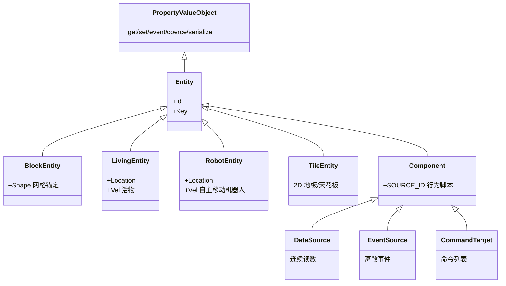
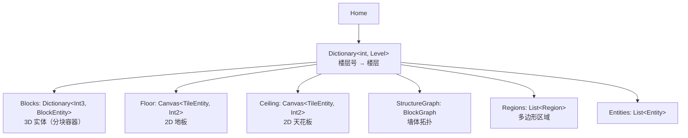
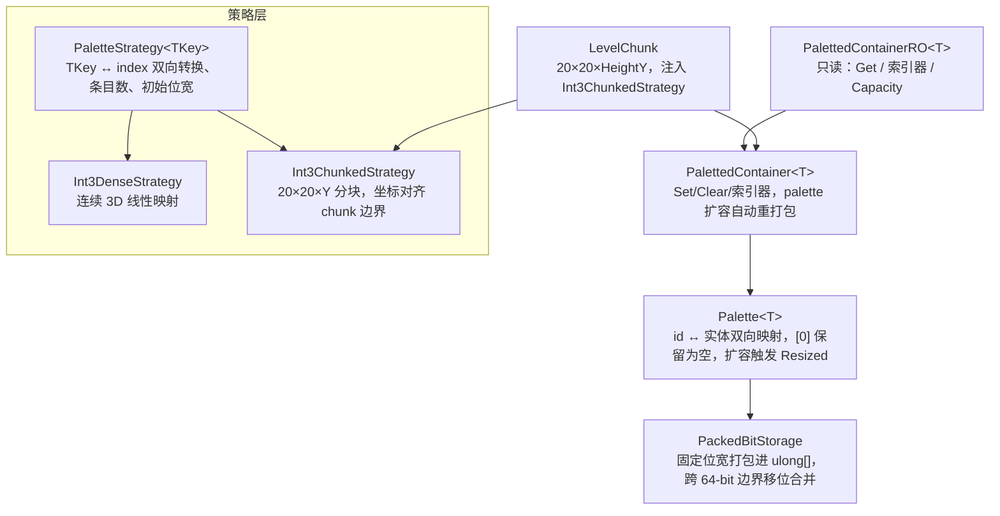
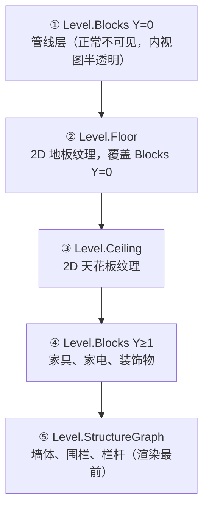
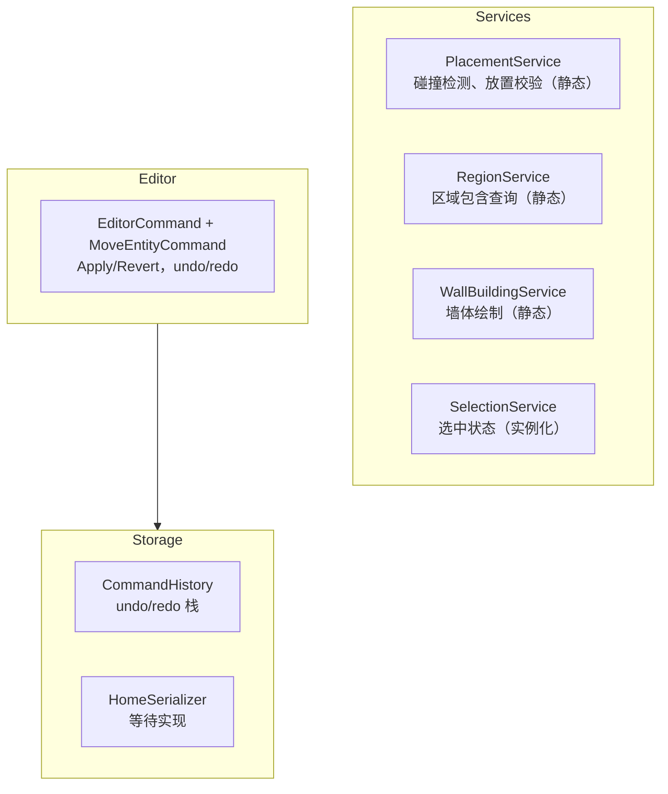
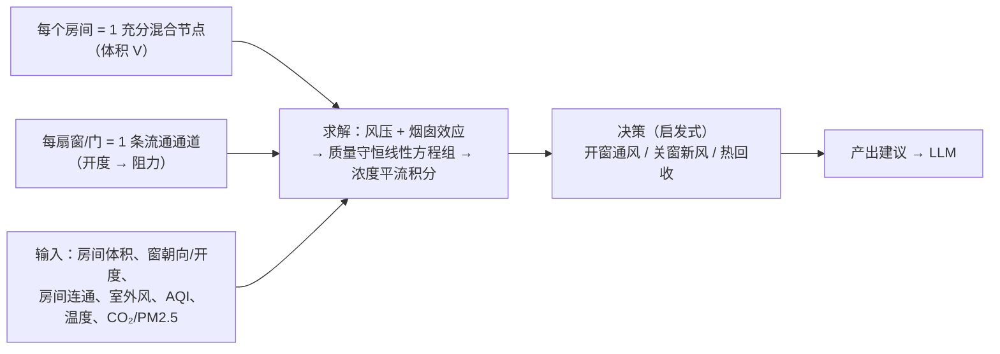

# Momoka.Home 架构设计

## 1. 总览

Momoka.Home 是家庭数字孪生模块：

| 子模块 | 职责 | 状态 |
|--------|------|------|
| **Models** | 实体、属性系统、空间数据结构、区域 | ✅ 核心完成 |
| **Services** | 放置/区域/墙体绘制等行为层 | ✅ 基础完成 |
| **Editor** | 编辑器命令（undo/redo） | ✅ 基础完成 |
| **Storage** | 存档、命令历史 | ✅ 基础完成 |
| **Providers** | 设备执行层抽象（HA、GIIC） | 📋 待实现 |
| **Build** | 视频流 → 3D 重建 → 网格 | 📋 待实现 |
| **Security** | 危险操作风险评估与拦截 | 📋 待实现 |

---

## 2. 坐标系统（Primitives）

`Momoka.Home/Primitives/`，与 Models 平级，跨模块使用。

| 类型 | 精度 | 用途 |
|------|------|------|
| `Int2(X, Z)` | 整数，10cm 步长 | 2D 网格：墙体占位、区域包含、BlockGraph 节点键 |
| `Int3(X, Y, Z)` | 整数，10cm 步长 | 3D 网格：分块容器索引 |
| `Float3(X, Y, Z)` | 连续浮点 | 移动实体位置、Shape 顶点 |
| `Key(ns, path)` | — | 命名空间键：`momoka:door` |

相互转换：`Int2 →(Y=0)→ Int3 →(隐式)→ Float3`，`Float3 →(Round)→ Int3 →(Drop Y)→ Int2`。

---

## 3. 属性系统（WPF DependencyObject 风格）

### 3.1 继承链



### 3.2 Property 类型

`Property<T>` 基类 + `BooleanProperty` / `EnumProperty<T>` / `FloatProperty` / `IntProperty` / `StringProperty` / `TextureProperty`。

### 3.3 Property API

`Name` / `TemplateKey` / `PropertyType` / `Description` / `DefaultValue` / `IsReadOnly` / `ValidateValueCallback` / `IsValidType` / `IsValidValue` / `ToSchema()` / `GetValidValues()` / `Create(...)`。

### 3.4 PropertyValueObject API

`AddProperty` / `GetValue`/`SetValue`（Property 或 string 键）/ `ClearValue` / 索引器 / `CoerceValue` / `event PropertyValueChanged` / `GetSchema()` / `ToDictionary()` / `Deserialize()`。

### 3.5 序列化

中间格式 `Dictionary<string, object?>`，委托外部库（Newtonsoft.Json）。

---

## 4. 实体系统

### 4.1 Children 与 Components 分离（Unity 风格）

| | Children（空间层级） | Components（行为脚本） |
|---|---|---|
| 添加/移除 | `AddChild` / `RemoveChild` | `AddComponent` / `RemoveComponent` |
| 查询 | `GetChild<T>()` / `GetChild(Guid)` / `FindChild(Guid)` | `GetComponent<T>()` / `GetComponents<T>()` / `GetComponentInChildren<T>()` / `TryGetComponent` |
| 遍历 | `Traverse()`（空间树） | — |

- 空间层级：门挂在墙上、笔记本放在桌上——删除宿主级联删除子物件
- 行为脚本：数据源、命令接口平铺，不参与空间

### 4.2 已实现实体

| 实体 | 继承 | Shape | 属性 |
|------|------|-------|------|
| `Wall` | `BlockEntity` | `LineShape` | `TEXTURE` |
| `Door` | `BlockEntity` | `BoxShape` | `open`, `locked`, `TEXTURE` |
| `Window` | `BlockEntity` | `BoxShape` | `open`, `TEXTURE` |
| `Appliance` | `BlockEntity` | `BoxShape` | `power`, `connection`, `TEXTURE` |
| `Curtain` | `Appliance` | `BoxShape` | + `position` (0-100) |
| `DataSourceEntity` | `Entity` | — | type/value/source_id |
| `Human` / `Pet` | `LivingEntity` | — | 待定义 |
| `RobotEntity` | `Entity` | — | 待定义 |

### 4.3 Shape 系统

`Shape` 抽象基类 + `LineShape`（Bresenham 直线 + 厚度展开）+ `BoxShape`（矩形枚举）。

---

## 5. 空间数据结构

### 5.1 Home → Level → LevelChunk



### 5.2 调色板容器（PalettedContainer）

Minecraft 风格：稀疏实体以短 id 打包进线性位数组，id 与实体经 Palette 映射。



### 5.3 分层渲染

自下而上的渲染顺序：



### 5.4 BlockGraph — 无向图

节点 `Node(Int2 Position)`，边 `Edge(Node A, Node B, BlockEntity? Entity)`。扁平 `Edges` 列表，单一真相源。非泛型——墙/栅栏/栏杆共享图。运算符：`+ pos`（加节点）、`+ (a,b)`（加边）、`- pos`（删节点）。

### 5.5 Region — 多边形区域

`Boundary: List<Int2>`（逆时针闭合多边形）+ `Children`（嵌套子区域）。包含判断用射线法。`Contains(Int2)` / `Contains(Float3)` / `Contains(BlockEntity)` / `ContainmentRatio(BlockEntity)`。

### 5.6 Level 查询 API

`ListEntities` / `GetEntitiesInRegion(Region|Int2,Int2)` / `GetEntityAtPoint` / `GetEntityAtNearest` / `FindEntity(Guid)` / `GetEntitiesOfType<T>` / `ListRegions` / `GetRegion(Int2|string)` / `AddRegion` / `RemoveRegion` / `TryCombineRegion`(TODO)。

---

## 6. Services / Editor / Storage



静态 Service 的函数接受 `Level` 参数，纯计算；实例化 Service 持有状态。

---

## 7. 待实现 / 未来计划

| 项 | 说明 |
|----|------|
| Providers | `IDeviceProvider`、`ProviderRegistry`、HA 实现 |
| Build 管线 | 视频流 → 3D 重建 → 网格 |
| Security | Blackboard + 规则评估 |
| 墙壁开口联动 | 删除墙 → 级联删除门窗 |
| ~~TileEntity~~ | ✅ 已实现（`Models/Entities/TileEntity.cs`） |
| 设备配置 JSON | `/devices/` JSON 定义第三方设备，无需写代码 |
| DSL 安全规则 | 复杂约束的表达式解析 |

### 7.1 空气流体模拟（未来）

不做 10cm 全屋 CFD（600K 格不可行）。采用**分段混合模型（房间粒度）**：



输入：房间体积（Region）、窗户朝向/开度（Window + Curtain.POSITION）、房间连通、室外风速风向（天气 DataSource）、室外 AQI（空气质量 DataSource）、室内外温度、室内 CO2/PM2.5。

求解：风压（朝向+风速²）+ 烟囱效应（温差+高度差）→ 质量守恒线性方程组 → 浓度平流积分 10 分钟。

决策（启发式即可）：
- AQI 低 → 开迎风窗自然通风
- AQI 高 + 风向朝卧室 → 关卧室窗，开背风窗或新风
- 温差大 → 优先新风（热回收）
- 积灰风险 = 室外 AQI × 风暴露 × 开窗率

归属：`Momoka.Home/Services/AirFlowModel.cs`（或 `Simulation/`），消费 Models 数据，产出建议给 LLM。

---

## 8. 目录总览

```
Momoka.Home/
├── Primitives/
│   ├── Int2.cs / Int3.cs / Float3.cs / Key.cs
├── Models/
│   ├── States/
│   │   ├── Property.cs + 6 个 Property 子类
│   │   ├── PropertyValueObject.cs
│   │   └── PropertyValueChangedEventArgs.cs
│   ├── Entities/
│   │   ├── Entity.cs / BlockEntity.cs / LivingEntity.cs / RobotEntity.cs / TileEntity.cs
│   │   ├── Wall.cs / Door.cs / Window.cs / Appliance.cs / Curtain.cs / DataSourceEntity.cs
│   │   └── Livings/ (Human.cs, Pet.cs)
│   ├── Levels/
│   │   ├── Level.cs / LevelChunk.cs
│   │   ├── Palette.cs / PackedBitStorage.cs
│   │   ├── PalettedContainer.cs / PalettedContainerRO.cs
│   │   └── PaletteStrategy.cs
│   ├── Shapes/
│   │   ├── Shape.cs / LineShape.cs / BoxShape.cs
│   ├── Canvas.cs / BlockGraph.cs / Region.cs / Home.cs / Location.cs
├── Services/
│   ├── PlacementService.cs / RegionService.cs / WallBuildingService.cs / SelectionService.cs
├── Editor/
│   └── EditorCommand.cs
├── Storage/
│   └── CommandHistory.cs
└── Momoka.Home.csproj               # 依赖：Newtonsoft.Json
```
