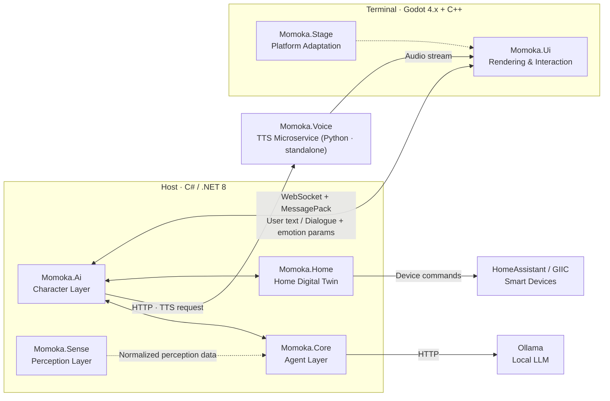

# Momoka

> **🌐 Language**: **English** | [简体中文](README.md)

**Open-Source AI Home Companion**

Momoka is an open-source AI home companion project, currently in its **early development stage**. Its goal is to build a system that represents the state of your home and, on top of that, provides character dialogue and task execution. The current code is mainly the "home digital twin" data model; the character engine, agent reasoning, UI rendering, and voice components are still planned or at scaffold stage. Please refer to [Current Progress](#current-progress) and [ROADMAP.md](ROADMAP.md) — do not treat planned designs as implemented capabilities.

The system uses a **Host + Terminal separation architecture**:

- **Host** (C# / .NET 8) handles all the "brain" work: character dialogue, agent reasoning, home perception, and device control.
- **Terminal** (Godot 4.x + C++) handles all "senses and expression" work: Live2D character rendering, 2D/3D scenes, speech recognition (ASR), speech synthesis (TTS), and audio output.

> ⚠️ **Project status**: This project is in an **early development stage**. The core data model in `Momoka.Home` is taking shape, but the other modules (character engine, agent reasoning, UI rendering, TTS, etc.) are currently **scaffolds / placeholder implementations**. See [Current Progress](#current-progress) and [ROADMAP.md](ROADMAP.md).

---

## Table of Contents

- [Introduction](#introduction)
- [Current Progress](#current-progress)
- [Features](#features)
- [System Architecture](#system-architecture)
- [Modules](#modules)
- [Quick Start](#quick-start)
- [Documentation](#documentation)
- [Roadmap](#roadmap)
- [Contributing](#contributing)
- [License](#license)

---

## Introduction

The problem Momoka tries to solve is: **let AI not only "talk", but also "understand this home"** — this is a goal, not yet implemented.

Traditional voice assistants can only answer questions; they cannot understand room layout, device state, or your home's physical environment. Momoka provides the AI with a programmable knowledge base of the home through a "home digital twin": where walls are, which rooms doors lead to, which room has poor air, which light should be turned off — then the character engine and agent jointly decide **what to say and what to do**.

### Design Goals

1. **Local-first**: Core reasoning runs on local LLMs (Ollama); speech and TTS components can run offline. Privacy matters.
2. **Modular**: Character / Agent / Sense / Home model / Rendering / Voice are fully decoupled and can be developed or replaced independently.
3. **Physical safety (planned)**: Device control should be guarded by safety constraints (L0–L4 tiers); dangerous operations (gas, door locks, high-voltage) should be blocked.
4. **Extensible device ecosystem**: A unified device abstraction layer integrates HomeAssistant and the GIIC protocol, and third-party devices can be declared via JSON.

---

## Current Progress

> Legend: ✅ Done · 🟡 Partial · 📋 Planned / Not started · 🔴 Scaffold only

| Module | Stack | Responsibility | Status |
|--------|-------|----------------|--------|
| **Momoka.Home** | C# / .NET 8 | Home digital twin: floor-plan data structures, device abstraction, safety constraints | 🟡 **Most mature**: core model done; device layer / safety layer pending |
| **Momoka.Voice** | Python 3.11+ | TTS microservice (GPT-SoVITS / IndexTTS2) | 🟡 HTTP skeleton works; TTS engine not integrated |
| **Momoka.Ai** | C# / .NET 8 | Character engine, memory, emotion state machine, dialogue safety filter | 📋 Entry scaffold only |
| **Momoka.Core** | C# / .NET 8 | Intent recognition, fast/slow routing, agent reasoning, tool scheduling | 📋 Entry scaffold only |
| **Momoka.Sense** | C# / .NET 8 | Wearable / GPS / environment sensor data collection | 📋 Entry scaffold only |
| **Momoka.Ui** | Godot 4.x + C++ | Live2D, 2D/3D scenes, VAD/ASR, audio I/O | 🔴 GDExtension entry scaffold |
| **Momoka.Stage** | Godot export configs | Desktop / Mobile / Panel platform adaptation | 🔴 README placeholders only |

### Implemented (2026-08)

- **Momoka.Home — Spatial data model**:
  - Coordinate system: `Int2` / `Int3` / `Float3` / `Key` (10cm grid steps)
  - Property system: `Property<T>` with 5 types (boolean / enum / float / int / string), Entity property system (get/set/events/serialization, value stored on `Property.Value`)
  - Entity system: `Entity<T>` (`Int2` tiles / `Int3` voxel content / `Float3` continuous living) + `Component` behavior carriers (`DataSource` / `EventSource` / `CommandTarget` / `VoxelLayoutSource`); implements `Wall`, `Door`, `Window`, `Appliance`, `Curtain`, etc.
  - Spatial structures: `Home → Level → LevelChunk` (20×20×Y chunks), Minecraft-style `PalettedContainer`, `BlockGraph` wall topology, `Region` polygon areas, `Canvas` floors/ceilings
  - Service layer: `PlacementService` (placement validation), `RegionService` (region queries), `WallBuildingService` (wall drawing), `SelectionService` (selection state)
  - Editor: `EditorCommand` / `MoveEntityCommand` + `CommandHistory` (undo / redo)
- **Momoka.Voice**: FastAPI skeleton with placeholder `GET /health` and `POST /tts` endpoints.

### Not implemented / Planned (see [ROADMAP.md](ROADMAP.md) for details)

- **Momoka.Home**: device abstraction `Providers` (HA / GIIC), `Security` (L3–L4 dangerous-operation blocking), `Build` pipeline (video → 3D reconstruction), `HomeSerializer` save system, device config JSON, DSL safety rules, airflow simulation, wall-opening cascade deletion.
- **Momoka.Ai / Core / Sense**: all core features pending (entry scaffolds only).
- **Momoka.Ui**: Live2D rendering, 3D scene, VAD, ASR, and audio I/O all pending.
- **Momoka.Stage**: platform export presets and platform code to be created.
- **Momoka.Voice**: integrate the GPT-SoVITS / IndexTTS2 inference engines.
- **Tests & CI**: **no test projects yet**; the `dotnet test` step in CI awaits real tests.

---

## Features

### ✅ Implemented

- 3D floor-plan data model (floors / chunks / entities / regions / wall topology)
- Property-based entity system (with serialization intermediate format)
- Placement validation, region queries, wall drawing, selection, undo/redo editing
- TTS microservice HTTP skeleton

### 📋 Planned

- Live2D character rendering with emotion-driven animation
- Local LLM intent recognition and agent tool scheduling
- Voice activity detection (VAD) and on-device speech recognition (ASR)
- Home device control (HomeAssistant / GIIC) with physical safety constraints
- Wearable / GPS / environment sensor perception
- Multi-platform terminals (desktop / mobile / control panel)
- Airflow simulation and natural ventilation suggestions

---

## System Architecture

Momoka consists of a **Host** (C# / .NET 8), a **Terminal** (Godot 4.x + C++), and standalone microservices. The Host and Terminal are designed to communicate over WebSocket + MessagePack (not yet implemented).



### Key Data Flows

> The flows below are **designed but not yet implemented**.

1. **Dialogue path**: Terminal (post-ASR text) → `Momoka.Ai` character engine → dialogue text + emotion params → Terminal (Live2D expression + TTS voice).
2. **Task path**: `Momoka.Ai` → `Momoka.Core` intent recognition (Ollama) → agent reasoning → tool calls (HA / calendar / weather).
3. **Device path**: `Momoka.Home` digital twin → device abstraction → HomeAssistant / GIIC → device control.
4. **Perception path**: `Momoka.Sense` collects wearable / GPS / environment data → normalize → `Momoka.Core` for decisions.

---

## Modules

| Module | Language | Responsibility | Directory |
|--------|----------|----------------|-----------|
| **Momoka.Ai** | C# / .NET 8 | Character engine, memory, emotion state machine, dialogue safety filter, TTS coordination | `Momoka.Ai/` |
| **Momoka.Core** | C# / .NET 8 | Intent recognition, fast/slow routing, agent reasoning loop, tool scheduling | `Momoka.Core/` |
| **Momoka.Sense** | C# / .NET 8 | Wearable bridging, GPS, environment sensor collection | `Momoka.Sense/` |
| **Momoka.Home** | C# / .NET 8 | 3D floor-plan data structures, device abstraction, GIIC, safety constraints | `Momoka.Home/` |
| **Momoka.Ui** | Godot 4.x + C++ | Live2D rendering, 2D/3D scenes, VAD, ASR, audio I/O | `Momoka.Ui/` |
| **Momoka.Stage** | Godot export configs | Desktop / Mobile / Panel platform adaptation | `Momoka.Stage/` |
| **Momoka.Voice** | Python 3.11+ | TTS microservice wrapping GPT-SoVITS / IndexTTS2 | `Momoka.Voice/` |

See each module's `README.md` for details.

---

## Quick Start

### Prerequisites

- [.NET 8 SDK](https://dotnet.microsoft.com/download/dotnet/8.0)
- [Godot 4.x](https://godotengine.org/download) (terminal UI)
- [CMake](https://cmake.org/download/) 3.20+ (GDExtension)
- [vcpkg](https://github.com/microsoft/vcpkg) (C++ dependencies)
- Python 3.11+ (Voice microservice)

### Build the Host (C#)

```bash
dotnet build Momoka.sln
```

### Build the Terminal UI (GDExtension)

```bash
cd Momoka.Ui
cmake -B build -DCMAKE_TOOLCHAIN_FILE=$VCPKG_ROOT/scripts/buildsystems/vcpkg.cmake
cmake --build build
```

### Run the Voice microservice

```bash
cd Momoka.Voice
pip install -r requirements.txt
python server.py   # listens on 0.0.0.0:8100 by default
```

> ⚠️ Since most modules are still scaffolds, a successful build does not mean full functionality. Check [ROADMAP.md](ROADMAP.md) for each module's maturity.

---

## Documentation

| Document | Description |
|----------|-------------|
| [README.md](README.md) | 简体中文版本 |
| [ROADMAP.md](ROADMAP.md) | Roadmap: the complete plan of done / in-progress / not-started work |
| [CONTRIBUTING.md](CONTRIBUTING.md) | Contribution guidelines |
| [CHANGELOG.md](CHANGELOG.md) | Changelog |
| [SECURITY.md](SECURITY.md) | Security vulnerability reporting |
| [CODE_OF_CONDUCT.md](CODE_OF_CONDUCT.md) | Contributor Code of Conduct |
| [Documentation/PROJECT_GUIDELINE.md](Documentation/PROJECT_GUIDELINE.md) | Project structure and module responsibilities overview |
| [Documentation/DESIGN_HOME.md](Documentation/DESIGN_HOME.md) | Momoka.Home architecture design |

---

## Roadmap

> For the complete, checkable roadmap see [ROADMAP.md](ROADMAP.md).
>
> **Development priority**: finish Momoka.Home first, then implement Momoka.Ui + Momoka.Stage to get the home management system running, and only then move to the AI companion phase (Ai / Core / Sense / Voice).

| Phase | Goal | Status |
|-------|------|--------|
| **Phase 0** | Infrastructure: CI, test framework, release process | 📋 Planned |
| **Phase 1** | Complete Momoka.Home (device layer, safety, persistence) | 🟡 In progress |
| **Phase 2** | Momoka.Ui home management terminal | 📋 Not started |
| **Phase 3** | Momoka.Stage platform adaptation | 📋 Not started |
| **Phase 4** | Momoka.Ai character layer (AI companion) | 📋 Not started |
| **Phase 5** | Momoka.Core agent reasoning (AI companion) | 📋 Not started |
| **Phase 6** | Momoka.Sense perception (AI companion) | 📋 Not started |
| **Phase 7** | Momoka.Voice TTS engine integration | 🟡 In progress |

---

## Contributing

Issues and Pull Requests are welcome! Please read [CONTRIBUTING.md](CONTRIBUTING.md) first.

Before submitting, make sure:

1. Code passes `dotnet build Momoka.sln`
2. Python code passes `ruff check`
3. Code style follows `.editorconfig`

---

## License

Licensed under the [GNU Affero General Public License v3.0](LICENSE) (AGPLv3).

---

> **🌐 Language**: **English** | [简体中文](README.md)
