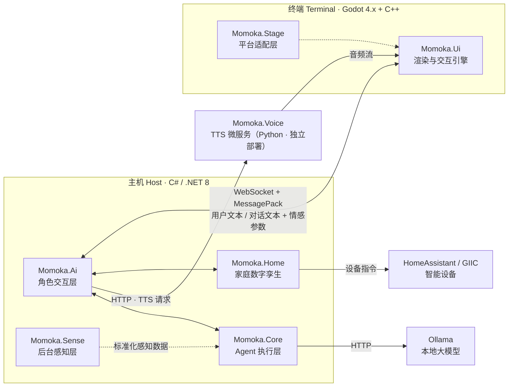

# Momoka

> **🌐 语言 / Language**：**简体中文** | [English](README.en.md)

**开源 AI 家庭伴侣系统 · Open-Source AI Home Companion**

Momoka 是一个开源的人工智能家庭伴侣项目，目前**仍处于早期开发阶段**。它的目标是构建一个能表达「家的状态」、并在此基础上提供角色对话与任务执行的系统。当前代码主要集中在「家庭数字孪生」的数据模型上；角色引擎、Agent 推理、UI 渲染、语音等仍处于规划或骨架阶段。请以[「当前进度」](#当前进度)与 [ROADMAP.md](ROADMAP.md) 为准，勿将文档中的设想当作已实现的能力。

系统采用 **主机（Host） + 终端（Terminal）分离架构**：

- **主机**（C# / .NET 8）负责所有「大脑」工作：角色对话、Agent 推理、家居感知与设备控制。
- **终端**（Godot 4.x + C++）负责所有「感官与表达」工作：Live2D 角色渲染、2D/3D 场景、语音识别（ASR）、语音合成（TTS）与音频输出。

> ⚠️ **项目状态**：本项目处于**早期开发阶段**。核心的 `Momoka.Home` 数据模型已初步成型，但其余模块（角色引擎、Agent 推理、UI 渲染、TTS 等）目前多为**脚手架/占位实现**。详见下方[「当前进度」](#当前进度)与 [ROADMAP.md](ROADMAP.md)。

---

## 目录

- [项目简介](#项目简介)
- [当前进度](#当前进度)
- [功能特性](#功能特性)
- [系统架构](#系统架构)
- [模块总览](#模块总览)
- [快速开始](#快速开始)
- [文档](#文档)
- [路线图](#路线图)
- [贡献](#贡献)
- [许可证](#许可证)

---

## 项目简介

Momoka 想解决的问题是：**让 AI 不仅「会说话」，还「懂这个家」**——这是目标，尚未实现。

传统语音助手只能应答问题，无法理解房间结构、设备状态与你家的物理环境。Momoka 通过「家庭数字孪生」为 AI 提供一份关于家的可编程知识：墙在哪、门通向哪、哪个房间的空气不好、哪盏灯该关了——然后由角色引擎与 Agent 共同决定**说什么、做什么**。

### 设计目标

1. **本地优先**：核心推理使用本地 LLM（Ollama），语音与 TTS 组件可离线运行，重视隐私。
2. **模块化**：角色 / Agent / 感知 / 家庭模型 / 渲染 / 语音完全解耦，可独立开发与替换。
3. **家庭物理安全（规划中）**：设备控制应受安全约束校验（L0–L4 分级），危险操作（燃气、门锁、高压）应被拦截。
4. **可扩展设备生态**：通过统一的设备抽象层接入 HomeAssistant 与 GIIC 协议，并支持第三方设备 JSON 声明。

---

## 当前进度

> 状态图例：✅ 已完成 · 🟡 部分完成 · 📋 规划中 / 未开始 · 🔴 仅骨架

| 模块 | 技术栈 | 职责 | 状态 |
|------|--------|------|------|
| **Momoka.Home** | C# / .NET 8 | 家庭数字孪生：户型数据结构、设备抽象、安全约束 | 🟡 **最成熟模块**：核心模型已实现；设备层 / 安全层待实现 |
| **Momoka.Voice** | Python 3.11+ | TTS 微服务（GPT-SoVITS / IndexTTS2） | 🟡 HTTP 骨架可用；TTS 引擎未集成 |
| **Momoka.Ai** | C# / .NET 8 | 角色引擎、记忆、情感状态机、对话安全过滤 | 📋 仅程序入口骨架 |
| **Momoka.Core** | C# / .NET 8 | 意图识别、快慢通道路由、Agent 推理、工具调度 | 📋 仅程序入口骨架 |
| **Momoka.Sense** | C# / .NET 8 | 可穿戴 / GPS / 环境传感器数据收集 | 📋 仅程序入口骨架 |
| **Momoka.Ui** | Godot 4.x + C++ | Live2D、2D/3D 场景、VAD/ASR、音频 I/O | 🔴 GDExtension 入口骨架 |
| **Momoka.Stage** | Godot 导出配置 | Desktop / Mobile / Panel 平台适配 | 🔴 仅占位 README |

### 已实现（2026-08）

- **Momoka.Home — 空间数据模型**：
  - 坐标系统：`Int2` / `Int3` / `Float3` / `Key`（10cm 网格步长）
  - 属性系统：`Property<T>` 及 6 种类型（布尔 / 枚举 / 浮点 / 整数 / 字符串 / 纹理）、Entity 属性系统（get/set/事件/序列化，值存于 `Property.Value`）
  - 实体系统：`Entity<T>`（`Int2` 瓦片 / `Int3` 体素内容 / `Float3` 连续活物）+ `Component` 行为载体（`DataSource` / `EventSource` / `CommandTarget` / `VoxelLayoutSource`），已实现 `Wall`、`Door`、`Window`、`Appliance`、`Curtain` 等
  - 空间结构：`Home → Level → LevelChunk`（20×20×Y 分块）、体素风格 `PalettedContainer`、`BlockGraph` 墙体拓扑、`Region` 多边形区域、`Canvas` 地板/天花板
  - 服务层：`PlacementService`（放置校验）、`RegionService`（区域查询）、`WallBuildingService`（墙体绘制）、`SelectionService`（选中状态）
  - 编辑器：`EditorCommand` / `MoveEntityCommand` + `CommandHistory`（undo / redo）
- **Momoka.Voice**：FastAPI 骨架，`GET /health` 与 `POST /tts` 接口占位。

### 未完成 / 待实现（详细计划见 [ROADMAP.md](ROADMAP.md)）

- **Momoka.Home**：设备抽象层 `Providers`（HA / GIIC）、`Security`（L3–L4 危险操作拦截）、`Build` 管线（视频 → 3D 重建）、`HomeSerializer` 存档、设备配置 JSON、DSL 安全规则、空气流体模拟、墙体开口级联删除。
- **Momoka.Ai / Core / Sense**：全部核心功能待实现（当前仅为入口占位）。
- **Momoka.Ui**：Live2D 渲染、3D 场景、VAD、ASR、音频 I/O 均待实现。
- **Momoka.Stage**：各平台导出配置与平台代码待创建。
- **Momoka.Voice**：接入 GPT-SoVITS / IndexTTS2 推理引擎。
- **测试与 CI**：目前**尚无测试项目**；CI 中 `dotnet test` 步骤待补充实际测试。

---

## 功能特性

### ✅ 已实现

- 3D 户型数据模型（楼层 / 分块 / 实体 / 区域 / 墙体拓扑）
- 基于属性的实体系统（含序列化中间格式）
- 放置校验、区域查询、墙体绘制、选中与撤销/重做等编辑能力
- TTS 微服务 HTTP 骨架

### 📋 规划中

- Live2D 角色渲染与情绪动画
- 本地 LLM 意图识别与 Agent 工具调度
- 语音活动检测（VAD）与本地语音识别（ASR）
- 家庭设备控制（HomeAssistant / GIIC）与物理安全约束
- 可穿戴设备 / GPS / 环境传感器感知
- 多平台终端（桌面 / 移动 / 中控屏）
- 空气流体模拟与自然通风建议

---

## 系统架构

Momoka 由**主机**（C# / .NET 8）、**终端**（Godot 4.x + C++）和**独立微服务**组成，主机与终端之间设计为通过 WebSocket + MessagePack 通信（尚未实现）。



### 关键数据流

> 以下为**设计中的数据流**，尚未全部实现。

1. **对话链路**：终端（ASR 后文本）→ `Momoka.Ai` 角色引擎 → 对话文本 + 情感参数 → 终端（Live2D 表情 + TTS 语音）。
2. **任务链路**：`Momoka.Ai` → `Momoka.Core` 意图识别（Ollama）→ Agent 推理 → 工具调用（HA / 日历 / 天气）。
3. **设备链路**：`Momoka.Home` 数字孪生 → 设备抽象层 → HomeAssistant / GIIC → 设备控制。
4. **感知链路**：`Momoka.Sense` 收集穿戴 / GPS / 环境数据 → 标准化 → `Momoka.Core` 决策依据。

---

## 模块总览

| 模块 | 语言 | 职责 | 目录 |
|------|------|------|------|
| **Momoka.Ai** | C# / .NET 8 | 角色引擎、记忆系统、情感状态机、对话安全过滤、TTS 协调 | `Momoka.Ai/` |
| **Momoka.Core** | C# / .NET 8 | 意图识别、快慢通道路由、Agent 推理循环、工具调度 | `Momoka.Core/` |
| **Momoka.Sense** | C# / .NET 8 | 可穿戴设备桥接、GPS、环境传感器数据收集 | `Momoka.Sense/` |
| **Momoka.Home** | C# / .NET 8 | 3D 户型数据结构、设备抽象层、GIIC 协议、安全约束校验 | `Momoka.Home/` |
| **Momoka.Ui** | Godot 4.x + C++ | Live2D 渲染、2D/3D 场景、VAD、ASR、音频 I/O | `Momoka.Ui/` |
| **Momoka.Stage** | Godot 导出配置 | Desktop / Mobile / Panel 平台适配 | `Momoka.Stage/` |
| **Momoka.Voice** | Python 3.11+ | TTS 微服务，封装 GPT-SoVITS / IndexTTS2 | `Momoka.Voice/` |

各模块的详细说明见其目录下的 `README.md`。

---

## 快速开始

### 前置要求

- [.NET 8 SDK](https://dotnet.microsoft.com/download/dotnet/8.0)
- [Godot 4.x](https://godotengine.org/download)（终端 UI）
- [CMake](https://cmake.org/download/) 3.20+（GDExtension）
- [vcpkg](https://github.com/microsoft/vcpkg)（C++ 依赖）
- Python 3.11+（Voice 微服务）

### 构建主机（C#）

```bash
dotnet build Momoka.sln
```

### 构建终端 UI（GDExtension）

```bash
cd Momoka.Ui
cmake -B build -DCMAKE_TOOLCHAIN_FILE=$VCPKG_ROOT/scripts/buildsystems/vcpkg.cmake
cmake --build build
```

### 启动 Voice 微服务

```bash
cd Momoka.Voice
pip install -r requirements.txt
python server.py   # 默认监听 0.0.0.0:8100
```

> ⚠️ 由于当前多数模块仍为骨架，构建成功不代表具备完整功能。请在 [ROADMAP.md](ROADMAP.md) 中查看各模块的成熟度。

---

## 文档

| 文档 | 说明 |
|------|------|
| [README.en.md](README.en.md) | English version |
| [ROADMAP.md](ROADMAP.md) | 路线图：已实现 / 进行中 / 未开始的完整计划 |
| [CONTRIBUTING.md](CONTRIBUTING.md) | 贡献指南 |
| [CHANGELOG.md](CHANGELOG.md) | 变更日志 |
| [SECURITY.md](SECURITY.md) | 安全漏洞报告 |
| [CODE_OF_CONDUCT.md](CODE_OF_CONDUCT.md) | 贡献者行为准则 |
| [Documentation/PROJECT_GUIDELINE.md](Documentation/PROJECT_GUIDELINE.md) | 项目结构与各模块职责总纲 |
| [Documentation/DESIGN_HOME.md](Documentation/DESIGN_HOME.md) | Momoka.Home 架构设计 |

---

## 路线图

> 完整、可勾选的路线图见 [ROADMAP.md](ROADMAP.md)。
>
> **开发优先级**：先完成 Momoka.Home，再实现 Momoka.Ui + Momoka.Stage 让家庭管理系统跑起来，之后进入 AI 伴侣阶段（Ai / Core / Sense / Voice）。

| 阶段 | 目标 | 状态 |
|------|------|------|
| **Phase 0** | 基础设施：CI、测试框架、发布流程 | 📋 规划中 |
| **Phase 1** | 完善 Momoka.Home（设备层、安全、存档） | 🟡 进行中 |
| **Phase 2** | Momoka.Ui 家庭管理终端 | 📋 未开始 |
| **Phase 3** | Momoka.Stage 平台适配 | 📋 未开始 |
| **Phase 4** | Momoka.Ai 角色交互层（AI 伴侣） | 📋 未开始 |
| **Phase 5** | Momoka.Core Agent 推理（AI 伴侣） | 📋 未开始 |
| **Phase 6** | Momoka.Sense 感知接入（AI 伴侣） | 📋 未开始 |
| **Phase 7** | Momoka.Voice TTS 引擎集成 | 🟡 进行中 |

---

## 贡献

欢迎提交 Issue 与 Pull Request！请先阅读 [CONTRIBUTING.md](CONTRIBUTING.md) 了解开发流程与代码规范。

提交前请确保：

1. 代码通过 `dotnet build Momoka.sln`
2. Python 代码通过 `ruff check`
3. 遵循 `.editorconfig` 中定义的代码风格

---

## 许可证

本项目基于 [GNU Affero General Public License v3.0](LICENSE)（AGPLv3）开源。

---

> 🌐 **语言 / Language**：**简体中文** | [English](README.en.md)
